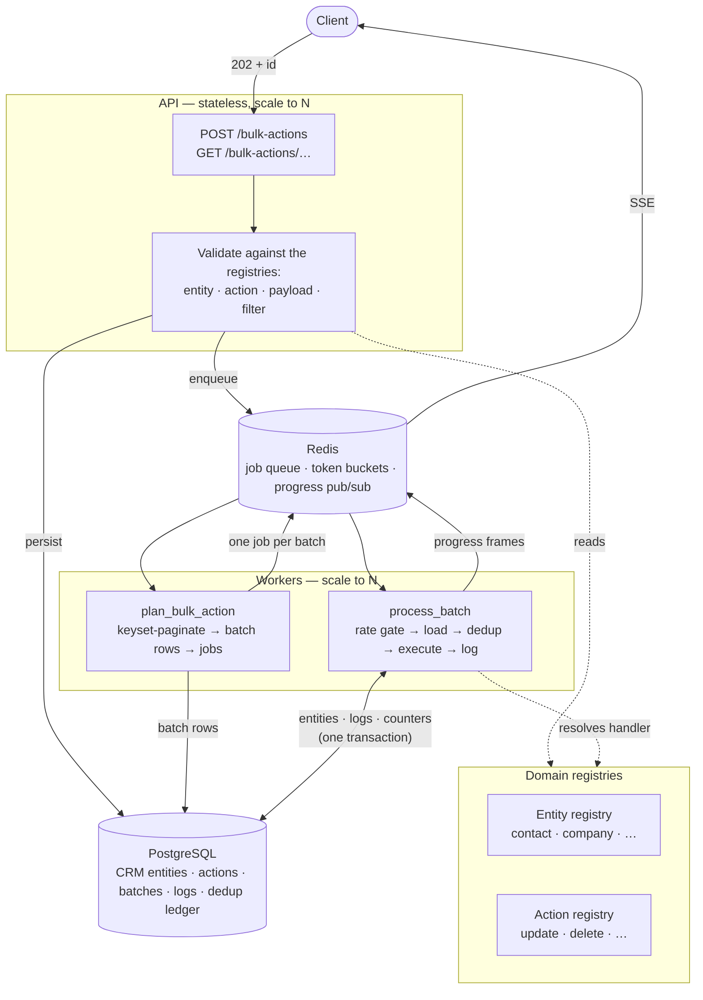

# Bulk Action Platform

A scalable, entity-agnostic platform for running bulk actions over CRM entities.

Submit an action against a million contacts and get an id back in milliseconds. The
platform plans the work into batches, spreads them across a fleet of workers, enforces a
per-account rate limit, skips duplicates, records the outcome of every single entity, and
reports live progress — all without any of that logic living inside the action itself.

Adding a new bulk action is **one file and one decorator**.

---

## Contents

- [Quick start](#quick-start)
- [What it does](#what-it-does)
- [Architecture](#architecture)
- [How a bulk action flows through the system](#how-a-bulk-action-flows-through-the-system)
- [Extensibility: adding a new bulk action](#extensibility-adding-a-new-bulk-action)
- [API reference](#api-reference)
- [Optional enhancements](#optional-enhancements)
- [Correctness under concurrency and failure](#correctness-under-concurrency-and-failure)
- [Performance and load testing](#performance-and-load-testing)
- [Scaling to a million entities](#scaling-to-a-million-entities)
- [Testing](#testing)
- [Design decisions and trade-offs](#design-decisions-and-trade-offs)
- [Assumptions](#assumptions)
- [What I would do with more time](#what-i-would-do-with-more-time)
- [Project layout](#project-layout)

---

## Quick start

**Prerequisites:** Docker Desktop (or Docker Engine + Compose v2). Nothing else.

```bash
git clone <repository-url>
cd bulk-action-platform

docker compose up -d --build          # postgres, redis, api, 2 workers
```

Migrations run automatically on API startup. Open <http://localhost:8000/docs>.

> Postgres is published on host port **5433** and Redis on **6380**, not their defaults.
> A locally installed PostgreSQL or Redis is common and will silently win the binding,
> which produces a confusing `password authentication failed` rather than a clean
> "port in use" error. Inside the compose network the services still use 5432/6379.

```bash
# 1. Create a tenant
curl -s -X POST localhost:8000/accounts \
  -H 'content-type: application/json' \
  -d '{"name":"Acme Logistics","rate_limit_per_minute":10000}'
# -> {"id":"<ACCOUNT_ID>", ...}

# 2. Generate demo contacts (20% share a duplicate email)
docker compose exec api python scripts/seed.py --count 50000 --duplicate-ratio 0.2

# 3. Submit a bulk update over all of them
curl -s -X POST localhost:8000/bulk-actions \
  -H 'content-type: application/json' \
  -d '{
    "account_id": "<ACCOUNT_ID>",
    "entity_type": "contact",
    "action_type": "update",
    "payload": {
      "updates": {"status": "churned"},
      "filter": {},
      "deduplicate_by": "email"
    }
  }'
# -> 202 {"id":"<ACTION_ID>","status":"queued", ...}

# 4. Watch it run
curl -N localhost:8000/bulk-actions/<ACTION_ID>/events     # live SSE stream
curl -s  localhost:8000/bulk-actions/<ACTION_ID>/stats     # summary
curl -s "localhost:8000/bulk-actions/<ACTION_ID>/logs?status=skipped"
```

**Running locally without Docker** — you still need Postgres 16 and Redis 7 somewhere:

```bash
python -m venv .venv && source .venv/bin/activate   # Windows: .venv\Scripts\activate
pip install -r requirements-dev.txt
cp .env.example .env                                # point DATABASE_URL / REDIS_URL at your instances
alembic upgrade head
uvicorn app.main:app --reload                       # terminal 1
arq app.workers.worker.WorkerSettings               # terminal 2
```

A `Makefile` wraps the common commands: `make up`, `make seed COUNT=200000`, `make test`,
`make loadtest ACCOUNT=<uuid>`, `make down`.

**Postman:** import `postman_collection.json`. The requests are ordered so that running the
collection top to bottom works with no manual editing — each request saves the ids it
creates into collection variables that later requests read.

---

## What it does

| Requirement | How it is met |
|---|---|
| Bulk update across many fields | `action_type: "update"`, `payload.updates` validated per entity |
| Batch processing | Target set split into batches of N; one queue job per batch |
| Handles up to a million entities | Keyset-paginated planning; constant memory; no per-entity job |
| Horizontal scaling | `docker compose up -d --scale worker=8`; correctness enforced by the database |
| Detailed per-entity logs | One `bulk_action_logs` row per entity, with a machine-readable reason code |
| Statistics endpoint | `GET /bulk-actions/{id}/stats` — success / failure / skipped, plus reason breakdowns |
| Action status (ongoing, completed, queued) | `GET /bulk-actions?status=...` |
| Real-time progress | `GET /bulk-actions/{id}` and an SSE stream at `/events` |
| Log retrieval and filtering | `GET /bulk-actions/{id}/logs?status=&reason_code=&entity_id=` |
| Modular, extensible design | Entity registry + action registry, both auto-discovered |
| Rate limiting (10k/min per account) | Redis token bucket, consumed per entity by the workers |
| De-duplication on email | Postgres-arbitrated ledger; duplicates logged as `skipped` |
| Scheduling | `scheduled_at` → the job is deferred on the queue itself |

All three optional enhancements are **implemented**, not just described.

---

## Architecture

**Stack:** Python 3.12 · FastAPI · PostgreSQL 16 · Redis 7 · arq · SQLAlchemy 2.0 (async) ·
Alembic · Pydantic v2 · structlog



### Why these components

**FastAPI + asyncio.** A bulk action API is almost entirely I/O — waiting on Postgres and
Redis. Async concurrency keeps the submission path cheap under load, and Pydantic v2 gives
per-entity request validation as a by-product of the type declarations.

**PostgreSQL, not a document store.** The workload needs exactly what Postgres is good at:
`INSERT ... ON CONFLICT DO NOTHING RETURNING` (which is how de-duplication stays correct
across concurrent workers), atomic in-place counter arithmetic, partial and expression
indexes, `RETURNING` on bulk updates, and transactional consistency between the entity
write and its audit log. A document store would have made the write path simpler and the
correctness argument much harder.

**Redis + arq for queueing.** arq is a Redis-backed, asyncio-native job queue.

| Requirement | arq |
|---|---|
| Future scheduling | `_defer_until=<datetime>` — native, no beat/cron sidecar to run or to fail |
| Retries with backoff | `max_tries` plus exponential backoff |
| Idempotent enqueue | `_job_id` — a repeated id is dropped, which is what makes re-planning safe |
| FastAPI fit | Same event loop as asyncpg; no sync/async bridge |
| Scale-out | N worker containers off one Redis |

**Why not Celery?** It is the better-known name, and if this were a team's first queue that
familiarity would count for a lot. But it is sync-first (bridging to an async ORM means a
thread pool or a second connection strategy), scheduling needs a separate `celery beat`
process, and its per-task `rate_limit` is *per worker* — it cannot express "10 000 entities
per minute per account" across a fleet. That last limit had to be hand-rolled against Redis
either way, so Celery's headline feature would have gone unused while its operational
weight stayed. The decision is reversible: the queue is touched in exactly two files
(`app/workers/`), and the tasks are ordinary coroutines.

---

## How a bulk action flows through the system

### 1. Submission — everything is validated before anything is enqueued

`POST /bulk-actions` resolves the entity and the action from the registries, then validates
the payload against the action's own schema *and* the entity's declared field types. A bad
value fails here, on the zeroth row, instead of failing identically on the millionth an hour
later.

```
POST /bulk-actions  {"payload": {"updates": {"age": 900}, "filter": {}}}
→ 422 {"code": "validation_error",
       "errors": [{"field": "age", "error": "Input should be less than or equal to 150"}]}
```

The submission-rate limiter is charged, the row is persisted, and one `plan_bulk_action` job
is enqueued — with `_defer_until` if the action is scheduled. The client gets `202` and an id.

### 2. Planning — memory stays constant no matter how large the target set

The planner walks the target set with **keyset pagination**:

```sql
SELECT id FROM contacts
WHERE account_id = $1 AND deleted_at IS NULL AND id > $2
ORDER BY id LIMIT 1000
```

`WHERE id > :last` is an index seek whose cost does not grow as you go deeper, unlike
`OFFSET`, which re-reads everything it skips. The `(account_id, id)` index makes each page
an index scan.

Two things this deliberately does **not** do:

- **It does not load the target set into memory.** Peak memory is one page of ids, whether
  the action targets a thousand entities or ten million.
- **It does not enqueue one job per entity.** A million jobs would make Redis the
  bottleneck and the per-job overhead would dwarf the work. One job per *batch* means a
  million entities is a thousand jobs.

Each batch is stored as an inclusive `[cursor_start, cursor_end]` id range — a constant
~100 bytes per batch row rather than a list of a thousand UUIDs. Batch rows are committed
in groups **before** their jobs are enqueued, so a worker can never dequeue a job whose row
is not yet visible.

### 3. Execution — one transaction per batch

Every batch runs the same pipeline, and it is identical for every action:

```
already completed?  →  return (idempotency guard)
action cancelled?   →  mark the batch cancelled, return
rate-limit gate     →  denied? re-schedule for when the bucket refills, return
load the slice      →  tenant-scoped; the live filter is re-applied inside the id range
de-duplicate        →  Postgres-arbitrated; losers become `skipped` logs
handler.execute()   →  the only action-specific step; one bulk UPDATE per batch
write logs          →  a single multi-row INSERT
advance counters    →  SET n = n + :delta on the action row
finalise if last    →  completed / completed_with_errors
```

The entity writes, the audit rows and the counter deltas **commit together**. There is no
window in which the contacts were updated but the logs were not, which is precisely what
makes a retry safe.

The action handler itself is one bulk statement:

```sql
UPDATE contacts SET status = $1, updated_at = now()
WHERE id = ANY($2) AND account_id = $3
RETURNING id
```

`= ANY($2)` rather than `IN ($1, …, $1000)`: one bind parameter and one cacheable plan
instead of a thousand parameters and a distinct plan per batch size. `RETURNING` tells us
exactly which rows were written, so an entity deleted between planning and execution is
*reported* rather than silently counted as a success.

### 4. Progress and finalisation

Counters live denormalised on the `bulk_actions` row and move with in-place arithmetic
inside the batch transaction. No worker ever reads a counter in order to write it, so
concurrent workers cannot lose an update — and `/stats` is a single-row read rather than an
aggregate over a log table with millions of rows.

The action is finalised by whichever worker's increment makes `completed_batches` reach
`total_batches`. That test lives in the `WHERE` clause of the finalising `UPDATE`, so
exactly one worker sees the transition. There is no separate "am I the last one?" race.

---

## Extensibility: adding a new bulk action

This is the design's central claim, so it is worth being precise about what it costs.

### Three steps

**1.** Create `app/domain/actions/bulk_archive.py`:

```python
from typing import Any, ClassVar
from pydantic import BaseModel, ConfigDict
from sqlalchemy import func, update

from app.domain.actions.base import ActionContext, BatchResult, BulkActionHandler, EntityOutcome
from app.domain.actions.registry import register_action
from app.domain.entities.base import EntityRow
from app.domain.sql_utils import pk_in
from app.models.enums import LogReason


class BulkArchiveConfig(BaseModel):
    model_config = ConfigDict(extra="forbid")
    filter: dict[str, Any] | None = None
    entity_ids: list[str] | None = None
    deduplicate_by: str | None = None


@register_action
class BulkArchiveAction(BulkActionHandler):
    action_type: ClassVar[str] = "archive"
    description: ClassVar[str] = "Move entities to the archived status."
    ConfigModel: ClassVar[type[BaseModel]] = BulkArchiveConfig

    async def execute(self, ctx: ActionContext, rows: list[EntityRow]) -> BatchResult:
        result = BatchResult()
        ids = [row.id for row in rows]
        stmt = (
            update(ctx.entity.table)
            .where(pk_in(ctx.entity.pk(), ids))
            .where(ctx.entity.account_col() == ctx.account_id)
            .values(status="archived", updated_at=func.now())
            .returning(ctx.entity.pk())
        )
        archived = {r[0] for r in (await ctx.session.execute(stmt)).all()}
        for entity_id in ids:
            result.outcomes.append(
                EntityOutcome.success(entity_id, LogReason.UPDATED)
                if entity_id in archived
                else EntityOutcome.failed(entity_id, LogReason.ENTITY_NOT_FOUND, "Gone.")
            )
        return result
```

**2.** There is no step 2. The `@register_action` decorator is the registration; the package
is auto-discovered at boot.

**3.** Restart. `POST /bulk-actions` accepts `"action_type": "archive"` on **every**
registered entity, and `GET /bulk-actions/registry` publishes its JSON Schema.

### What the new action gets for free

Batching · queueing · retries with backoff · per-account rate limiting · de-duplication ·
per-entity logging with reason codes · progress counters · the stats endpoint · log
filtering and pagination · cancellation · scheduling · idempotent retries · SSE streaming.

### What it did *not* have to touch

The API routes, the schemas, the planner, the batch runner, the rate limiter, the
de-duplicator, the logging pipeline, the database schema, or any migration.

### Adding a new entity

One descriptor plus one table. `app/domain/entities/company.py` is the whole definition of
Company as far as this platform is concerned:

```python
@register_entity
class CompanyEntity(EntityDescriptor):
    name = "company"
    table = Company.__table__
    updatable_fields = {
        "name": FieldSpec(annotation=Annotated[str, Field(min_length=1, max_length=255)]),
        "employee_count": FieldSpec(annotation=Annotated[int, Field(ge=0)], nullable=True),
        ...
    }
    dedup_fields = frozenset({"domain"})   # not email — the key is a property of the entity
    soft_delete_column = "deleted_at"
```

Every registered action works on it immediately.

### This is tested, not asserted

`tests/integration/test_extensibility.py` defines a brand-new action **inside the test
file** — never imported by any application module — and asserts that it appears in the
registry, runs through the shared pipeline, produces the same per-entity audit trail, and
finalises correctly. If the abstraction ever leaks, that test fails.

---

## API reference

### Required endpoints

| Method | Path | Purpose |
|---|---|---|
| `POST` | `/bulk-actions` | Submit an action. `202` + id, or `200` on an idempotency replay |
| `GET` | `/bulk-actions` | List, filterable by `account_id`, `status`, `entity_type`, `action_type` |
| `GET` | `/bulk-actions/{id}` | Detail and live progress |
| `GET` | `/bulk-actions/{id}/stats` | Success / failure / skipped summary |

### Additional endpoints

Added because the assignment's *UI Interaction* section implies them.

| Method | Path | Purpose |
|---|---|---|
| `GET` | `/bulk-actions/{id}/logs` | Per-entity logs; filter by `status`, `reason_code`, `entity_id`; keyset paginated |
| `GET` | `/bulk-actions/{id}/batches` | Batch-level progress and retry counts |
| `GET` | `/bulk-actions/{id}/events` | Real-time progress over SSE |
| `POST` | `/bulk-actions/{id}/cancel` | Cancel a scheduled, queued or running action |
| `GET` | `/bulk-actions/registry` | The live entity × action matrix, with payload schemas |
| `POST` | `/accounts`, `GET` `/accounts`, `PATCH` `/accounts/{id}` | Tenants and their rate limits |
| `POST` | `/entities/{type}/seed`, `GET` `/entities/{type}` | Demo data and verification |
| `GET` | `/healthz`, `/readyz` | Liveness and readiness |

### Request shape

```jsonc
POST /bulk-actions
{
  "account_id": "uuid",
  "entity_type": "contact",          // any registered entity
  "action_type": "update",           // any registered action
  "payload": {                       // validated against the action's own schema
    "updates": {"status": "churned", "age": 41},
    "filter": {"status": "active", "age": {"gte": 30}},
    "deduplicate_by": "email"
  },
  "batch_size": 1000,                // optional; clamped to the account rate limit
  "scheduled_at": "2026-11-22T11:15:00Z",   // optional
  "idempotency_key": "nightly-sync-2026-09-02"  // optional
}
```

**Selecting the target set** — exactly one of:

- `"filter": {...}` — a filter object. `{}` means every entity in the account.
- `"entity_ids": [...]` — an explicit list, frozen at submission time.

Supplying neither is a `422`. The platform refuses to guess, because the difference between
"no filter" and "match everything" is a million rows.

**Filter operators:** `eq` (the shorthand form), `ne`, `gt`, `gte`, `lt`, `lte`, `in`,
`not_in`, `contains`, `is_null`. Only fields the entity declares as filterable are accepted,
and values are always bound as parameters — a filter cannot inject SQL.

**Errors** are RFC 7807 problem+json:

```json
{"type": "about:blank#validation_error", "title": "Invalid request",
 "status": 422, "code": "validation_error",
 "detail": "Invalid update values for 'contact'.",
 "errors": [{"field": "age", "error": "Input should be less than or equal to 150"}]}
```

### Lifecycle

```
                   ┌──────────────┐
   scheduled_at →  │  scheduled   │
                   └──────┬───────┘
                          ↓
  submit  →  queued  →  planning  →  processing  →  completed
                                          │       ↘  completed_with_errors
                                          │       ↘  failed
                                          └──────→  cancelled
```

---

## Optional enhancements

### Rate limiting — 10 000 entities/minute per account

A **token bucket** in Redis, evaluated by an atomic Lua script (`app/services/rate_limiter.py`).

*Why a bucket and not a fixed window:* a fixed window lets an account burn 10 000 entities
at 11:59:59 and another 10 000 at 12:00:00 — 20 000 inside one second. The bucket refills
continuously, so the sustained rate really is the limit.

*Why Lua:* check-and-consume must be atomic across many worker processes. One round trip,
no read-modify-write race.

*Where it is enforced:* in the worker, **before** a batch does any work, consuming tokens
equal to the batch's entity count. Limiting requests instead of entities would be
theatre — one request can mean a million entities.

*What happens on denial:* the batch is re-enqueued with `_defer_by` set to when the bucket
will have refilled. Nothing is burned, nothing is lost, and the retry budget is untouched
because this is a fresh job rather than a failure. The batch row stays `pending`, so the
work is provably still owed.

*A subtlety:* a batch larger than the per-minute limit could never be admitted, so
`effective_batch_size()` clamps the batch size to the account's limit at submission time.
An account limited to 600/min gets batches of 600, not 1000.

Two limits are enforced: **processing** (entities/minute, per account, configurable per
account via `accounts.rate_limit_per_minute`) and **submission** (bulk actions/minute,
guarding the write path, `429` with a `Retry-After` header).

### De-duplication — skip duplicate entities by email

Set `"deduplicate_by": "email"`. The first entity for each email is processed; every later
one is written to the logs as `status: "skipped"`, `reason_code: "duplicate_email"`, with
the offending value in `details` so a user can act on it.

The hard part is that batches run concurrently, so two copies of `ada@example.com` can be
examined at the same instant in different worker processes — and a *retried* batch must not
change its mind about which copy won. An in-process `set()` gets both cases wrong.

So the database arbitrates. `bulk_action_dedup` has a primary key of
`(bulk_action_id, dedup_key)`, and one statement settles it:

```sql
INSERT INTO bulk_action_dedup (bulk_action_id, dedup_key)
VALUES (...), (...), ...
ON CONFLICT DO NOTHING
RETURNING dedup_key
```

The returned keys are the ones this caller claimed first. Anything absent was claimed by
someone else — or by this same batch on an earlier attempt, which is exactly the behaviour
a retry needs.

Keys are normalised (trimmed, lowercased), so ` Ada@Example.COM ` and `ada@example.com` are
the same entity. Entities whose dedup field is empty are passed through rather than
skipped: a NULL email is not evidence of duplication.

De-duplication is **not** email-specific. Each entity declares its own `dedup_fields`;
Company de-duplicates on `domain` through the identical code path.

### Scheduling — start at a future time

Pass `"scheduled_at": "2026-11-22T11:15:00Z"`. The action is stored as `scheduled` and the
planning job is enqueued with arq's `_defer_until`, so **the queue itself holds the delay**.
There is no cron process, no beat sidecar, and no polling loop to run or to fail. A past
timestamp is a `422`. A scheduled action can be cancelled before it starts.

---

## Correctness under concurrency and failure

At-least-once delivery is the only guarantee a queue can actually give, so every step is
built to be safely re-runnable.

| Hazard | How it is handled |
|---|---|
| Duplicate batch job delivered | `process_batch` returns immediately if the batch is already `completed` |
| Duplicate enqueue | `_job_id` is deterministic (`batch:{action}:{index}`); arq drops repeats |
| Planner re-runs after a partial pass | Batch rows insert with `ON CONFLICT DO NOTHING` on `(bulk_action_id, batch_index)`; totals are written absolutely, never incrementally, so re-planning converges |
| Worker crashes mid-batch | The transaction rolls back; entities, logs and counters are all untouched; arq redelivers |
| Two workers increment the same counter | `SET n = n + :delta` — no counter is ever read in order to be written |
| Two workers finish the last batch simultaneously | The completeness test lives in the finalising `UPDATE`'s `WHERE`; exactly one transition wins |
| Same email in two concurrent batches | Arbitrated by a database primary key, not process memory |
| A batch fails every retry | It is marked `failed`, its entities are logged as failed, counters advance, and the action still finalises — one bad batch does not strand the other 999 |
| Entity deleted between planning and execution | `RETURNING` reveals it; logged as `entity_not_found` / `left_target_set`, so `processed_count` can still reach `total_entities` and progress never stalls at 99% |
| Client retries a submission after a timeout | `idempotency_key` returns the original action and enqueues nothing |
| Cross-tenant id in `entity_ids` | Row loads are tenant-scoped, so it returns no row and is reported as not-found. It can never be read or written |

**Cancellation semantics.** Batches that have already committed keep their work. A bulk
action is not a transaction, and pretending otherwise would mean holding a lock over a
million rows. Workers check the action status before each batch, so in-flight work stops at
the next batch boundary. `GET /bulk-actions/{id}/stats` after a cancel tells you exactly how
far it got.

---

## Performance and load testing

```bash
docker compose up -d --scale worker=4
docker compose exec api python scripts/seed.py --count 200000
python scripts/load_test.py --account-id <ACCOUNT_ID>
```

The load test drives the system as a client would — HTTP submission, queue, workers,
Postgres — and reports throughput from the platform's own counters, so the number it prints
is the same one `/stats` reports.

```
====================================================================
LOAD TEST RESULTS
====================================================================
  actions submitted   : 1
  entities processed  : 200,000
    success           : 200,000
    failed            : 0
    skipped           : 0
  wall clock          : 59.8s  (includes submission and polling)

  action 13f4200b-07ef-4cd4-8d3d-343155d01089
    status            : completed
    batches           : 200/200
    server duration   : 20.96s
    entities/minute   : 572,501

  aggregate           : 200,653 entities/minute
====================================================================
```

**Measured on:** Windows 11 + WSL2, Docker Desktop, 8 vCPU / 3.7 GB allocated to the
Linux VM, 4 worker replicas, Postgres 16 and Redis 7 in containers on the same host,
200 batches of 1 000, no de-duplication, account rate limit raised so the limiter was not
the binding constraint.

Two numbers, because they measure different things and only one of them is the throughput
of the batch pipeline:

- **572,501 entities/minute** — `server duration`, the 20.96s from the first batch starting
  to the last batch finishing. This is what the workers sustain.
- **200,653 entities/minute** — wall clock, which also includes HTTP submission, the
  planning pass that enumerates 200 000 ids into 200 batch rows, and up to a second of
  polling granularity at the end.

The assignment asks for "thousands of entities per minute". Both figures clear that by two
orders of magnitude, and neither was tuned for the benchmark. Postgres is the limit here,
not the queue: `docker stats` shows the workers idle-waiting on it.

Re-running with the default 10 000/min account limit produces exactly 10 000/min sustained
after an initial burst of one full bucket — which is the rate limiter working, not a
regression.

**Where the throughput comes from**

- **One `UPDATE` per batch, not per entity.** A thousand entities is one round trip.
- **One multi-row `INSERT` for the logs**, not a thousand.
- **`= ANY($1)`** instead of a thousand-parameter `IN` list — one cacheable plan.
- **No-op updates are skipped.** A row that already holds the target value is logged as
  `no_change` rather than rewritten; a no-op `UPDATE` still writes a new row version.
- **Counters are incremented, never recomputed.**
- **Workers are I/O bound**, so `max_jobs` is set well above the core count.

**Knobs:** `--scale worker=N` (the main one), `batch_size` per action, `WORKER_CONCURRENCY`,
and the account's `rate_limit_per_minute` — which is a *ceiling*, so if you are measuring
raw capacity, raise it first.

---

## Scaling to a million entities

What is already true:

- **Planning is memory-constant** — keyset pagination, one page of ids at a time.
- **Jobs are per batch, not per entity** — a million entities is a thousand jobs.
- **Progress reads are O(1)** — denormalised counters, not aggregates.
- **Log reads are keyset paginated** — `id > cursor` stays an index seek a million rows deep.
- **Workers are stateless** — `--scale worker=N` is the whole scaling story.

What I would add before running this at that scale in production, and why it is not here:

**Partition `bulk_action_logs`.** It grows fastest — one row per entity per action. Range
partitioning by `created_at` (monthly) makes retention a `DROP PARTITION` instead of a
`DELETE` that leaves bloat, and keeps index depth bounded. The application needs no change;
it is a migration. Left out because it adds operational machinery that a two-day project
cannot demonstrate the value of.

**Retention.** Logs are the largest table and the least valuable after a week. A scheduled
job dropping partitions older than N days, with a summary retained on the action row (which
already holds the counters).

**Queue sharding.** One Redis queue saturates around tens of thousands of jobs/second, well
beyond this workload, but per-account or per-priority queues would stop one tenant's
million-row action from delaying everyone else's small ones. arq supports named queues, so
this is a routing change in `plan_bulk_action`.

**A read replica** for `GET` traffic, so status polling never competes with batch writes.

**PgBouncer** in transaction mode once worker replicas multiply — the engine already sets
`statement_cache_size=0`, which is the setting that makes asyncpg compatible with it.

**Backpressure.** Today an account can queue unbounded actions; the rate limiter throttles
*processing* but not *accumulation*. A cap on concurrently active actions per account,
returning `429`, is the natural next control.

---

## Testing

```bash
pytest tests/unit -q     # no infrastructure needed
pytest -q                # + integration
```

**Integration tests provision their own infrastructure.** They take the first of these that
works, so `pytest` is always runnable and never fails merely for want of a database:

1. **Something already reachable** at `TEST_DATABASE_URL` / `TEST_REDIS_URL` — typically
   `docker compose up -d postgres redis`. Fastest, because nothing has to start.
2. **Ephemeral containers**, started automatically with
   [testcontainers](https://testcontainers.com/) when nothing is reachable. `pytest` alone
   is then sufficient, and each run gets a throwaway database that cannot collide with a
   locally installed PostgreSQL or clobber development data. Force this path with
   `TEST_FORCE_TESTCONTAINERS=1` when isolation matters more than speed.
3. **Skipped**, when there is no Docker daemon either.

The containers are pinned to the same images `docker-compose.yml` runs, so the tests
exercise the versions the application is actually deployed against.

**Unit tests** cover the registries, per-entity validation and coercion, filter compilation
(including that a filter value can never become SQL), batch-size clamping, explicit-id
chunking, and dedup key normalisation.

**Integration tests** run against a real Postgres and Redis and exercise the *production*
worker functions — `plan_bulk_action` and `process_batch` are imported, not reimplemented.
Only the queue is replaced, and only so that execution order is deterministic. They cover:

- the full submit → plan → batch → finalise flow, verifying the rows actually changed and
  that there is exactly one log row per entity;
- de-duplication counts against the true distinct-email count, and its stability across a
  batch replay;
- rate limiting deferring a batch rather than dropping it, and the batch remaining `pending`;
- scheduling deferring the job instead of running it;
- cancellation stopping remaining batches while committed batches keep their work;
- idempotency replay returning the original action and enqueueing nothing;
- entities that vanish mid-flight still being accounted for, so progress reaches 100%;
- no-op updates being skipped rather than rewritten;
- an empty target set completing rather than hanging;
- logs being filterable and keyset paginated without repeating rows;
- **extensibility**: a new action defined inside the test file running end to end.

CI (`.github/workflows/ci.yml`) runs ruff, mypy, a migration check and the full suite
against service containers on every push.

---

## Design decisions and trade-offs

**Uniform updates, not per-entity values.** `updates` applies the same values to every
entity in the target set, which is what the assignment describes. Per-entity values would
be a different action — `bulk_upsert`, using `UPDATE ... FROM (VALUES ...)` — and it would
reuse every part of the platform. Adding it is the three steps above.

**Batches store an id *range*, not an id list.** A constant ~100 bytes per batch row instead
of a thousand UUIDs. The cost: the live filter is re-applied when the batch runs, so an
entity that stopped matching in between is not silently updated. That drift is *counted*
exactly (`entity_count` minus rows loaded) and logged as `left_target_set` with a null
entity id — we know how many vanished but not which, and saying otherwise would be a lie.
Explicit `entity_ids` selections store the ids verbatim, because a client that named
specific entities should get exactly those.

**Denormalised counters instead of aggregating logs.** `/stats` on an action with a million
log rows must not be a `COUNT(*) GROUP BY`. The cost is that the counters must be advanced
in the same transaction as the logs — which the batch runner does, and which the tests check
by asserting `success + failure + skipped == total`.

**Status as `VARCHAR` + `CHECK`, not a native `ENUM`.** Adding a value to a Postgres enum
requires a migration that cannot run inside a transaction, which makes rolling deploys
awkward. Same integrity, far cheaper migration path.

**Soft delete by default.** A bulk delete over a filter is the single most dangerous
operation here. Soft delete makes it reversible; `"hard": true` is opt-in.

**SQLAlchemy Core in the hot path, ORM only for schema.** Batch workers read and write
thousands of rows per job and need none of the identity map or lazy loading. The models
exist for migrations and for readable table definitions.

**SSE rather than WebSockets** for progress: the traffic is one-directional, and SSE
survives proxies and reconnects without extra code.

**No authentication.** Out of scope for the assignment, and adding a half-considered auth
layer would be worse than leaving a clean seam. `account_id` is a request field; in
production it would come from a verified token, and the tenant scoping that already runs on
every query would be unchanged.

**The alternatives I rejected**, briefly: Postgres `SKIP LOCKED` as the queue (one less
service, but no native delayed jobs and I would have rebuilt scheduling by hand); Celery
(see above); one job per entity (a million jobs, per-job overhead dwarfing the work);
loading the target set in the API (unbounded memory).

---

## Assumptions

1. **One entity type per bulk action.** The assignment states multi-entity integration is
   not required; the architecture is entity-agnostic, and two entities ship to prove it.
2. **`account_id` is supplied in the request body.** There is no auth layer; see above.
3. **Uniform field values across the target set** — the assignment's "update multiple fields
   for an entity".
4. **De-duplication is scoped to a single bulk action.** Two separate actions each process
   `ada@example.com`; within one action, only the first occurrence is processed. The ledger
   is keyed by `(bulk_action_id, dedup_key)`, so cross-action de-duplication would be a
   different key, not a different design.
5. **`scheduled_at` is UTC.** A naive timestamp is interpreted as UTC.
6. **Cancellation is at batch granularity**, not entity granularity — see above.
7. **Rate limits are per account, not global.** A global ceiling would be another bucket
   with a fixed key, using the same limiter.
8. **Demo data is generated, not imported from a CSV.** The seeder produces realistic rows
   with a controllable duplicate ratio, which makes de-duplication demonstrable at any
   volume — more useful than a fixed CSV.

---

## What I would do with more time

- Fill in measured load-test numbers across 1, 2, 4 and 8 workers to show the scaling curve.
- Partition `bulk_action_logs` and add a retention job.
- Prometheus metrics (queue depth, batch latency, entities/second, rate-limit denials) and
  OpenTelemetry traces from submission through to batch completion.
- A dead-letter queue for batches that exhaust their retries, with a replay endpoint —
  today they are marked `failed` and logged, but replaying means resubmitting the action.
- Per-account queue sharding so one tenant's million-row action cannot delay another's.
- `bulk_upsert` with per-entity values, and a `bulk_export` action, mostly to demonstrate
  that a non-mutating action fits the same abstraction.
- Auth, and a cap on concurrently active actions per account.

---

## Project layout

```
app/
  main.py                      FastAPI factory, lifespan, request-id middleware
  core/
    config.py                  Environment-driven settings
    db.py                      Async engine, transactional session scope
    redis.py                   arq pool + plain client
    errors.py                  Domain exceptions → RFC 7807 responses
    logging.py                 structlog, JSON in production
  domain/                      ← the extensibility surface
    entities/
      base.py                  EntityDescriptor + FieldSpec contracts
      registry.py              @register_entity, auto-discovery
      contact.py, company.py   One file per entity
    actions/
      base.py                  BulkActionHandler contract, EntityOutcome, BatchResult
      registry.py              @register_action, auto-discovery
      bulk_update.py           The initial action
      bulk_delete.py           The extensibility proof
    filters.py                 JSON filter → bound SQLAlchemy predicates
    sql_utils.py               `id = ANY($1)` helper
  models/                      SQLAlchemy tables + status vocabularies
  schemas/                     Pydantic request/response models
  services/
    bulk_action_service.py     Submission, listing, stats, logs, cancellation
    batching.py                Keyset-paginated batch planner
    batch_runner.py            The generic per-batch pipeline
    dedup.py                   Postgres-arbitrated de-duplication
    rate_limiter.py            Redis token bucket (Lua)
    progress.py                Counters, finalisation, SSE publishing
    logs.py                    Bulk audit-log writes
    seeding.py                 Entity-agnostic demo data (COPY)
  workers/
    worker.py                  arq WorkerSettings
    tasks.py                   plan_bulk_action, process_batch
alembic/versions/              Migrations
scripts/                       seed.py, load_test.py
tests/unit/, tests/integration/
docker-compose.yml  Dockerfile  Makefile  postman_collection.json
```
